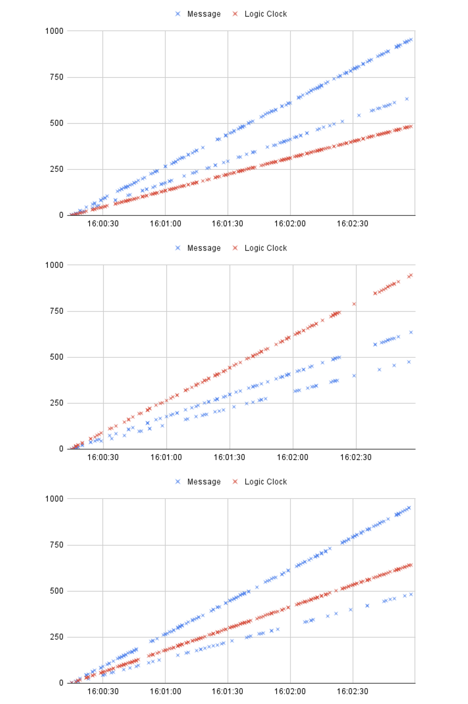

# Engineering Notebook

## Part 1: Design
Instead of the producer/consumer structure that we were advised to follow in lab, we constructed a `VirtualMachine` class that had internal methods to initialize the machine, send messages, receive messages, connect, update the Lamport clock, and write to a log file for that machine. This yielded the added benefits of neither needing to store global data structures nor using pairwise buffers.

We chose to store incoming messages in a `Queue` object from the `multiprocessing` package, because its existing `put` and `get` functionalities made it easy for what we wanted to achieve. 

## Part 2: Experimental Analysis

### Procedure

We ran our code 5 times, each run lasting a random duration between 1-3 minutes. Then, we converted our text logs from each machine per run into data to parse. We cleaned the data to identify its numerical values that we were interested in - primarily logical clock, system clock, message value, and message queue length - to conduct our analysis below.

### Results and Reflections
 <!-- discuss (in the lab book) the size of the jumps in the values for the logical clocks, drift in the values of the local logical clocks in the different machines (you can get a god’s eye view because of the system time), and the impact different timings on such things as gaps in the logical clock values and length of the message queue.  -->

When we aggregated and plotted the results across the machines from each experimental run (Figures 1-6), we noticed that both the message values and the logic clock values displayed mostly linear patterns while containing gaps in their linear trendlines. 

But if we look at a more granular level, we observed that each machine on every experimental run displayed different behavior. For example, in experimental run 4 (Figures 4-6), each graph displayed three trendlines - two message value trendlines (one for each of the other machines) and one logic clock value trendline. This meant that all three machines were operating at different clock rates. 

In contrast, in experimental run 1 (Figures 1-3), we see only two trendlines in each graph, suggesting that virtual machines 0 and 2 had the same clock rate. Virtual machines 0 and 2 received higher message values than their associated logic clock values, while virtual machine 1 received lower message values. The jumps in logical clock values were narrower in Figure 1 than Figure 2 (which was much sparser) and Figure 3.

Figures 1-3 (top to bottom): Graphs for message and logic clock values over the course of global time, across 3 virtual machines (from top to bottom is virtual machine 0, 1, and 2 respectively) in experimental run 1.

Figures 4-6 (top to bottom): Graphs for message and logic clock values over the course of global time, across 3 virtual machines (from top to bottom is virtual machine 0, 1, and 2 respectively) in experimental run 4, the run with the longest duration.

We did not notice any patterns regarding the impact that different timings had on the message queue lengths; it may be hard for us to observe a pattern because our message queue length had low variance, as we see in Figure 7. 

Figure 7: Graph for message queue length as compared to logic clock time for virtual machine 0 in experimental run 4.
